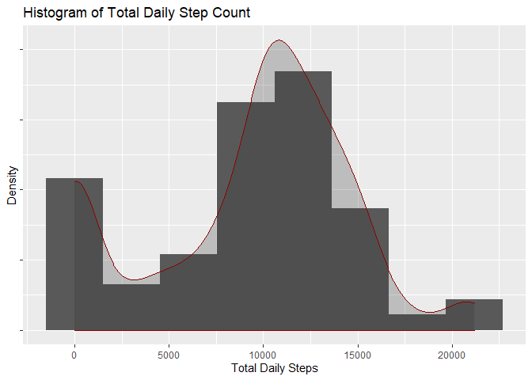
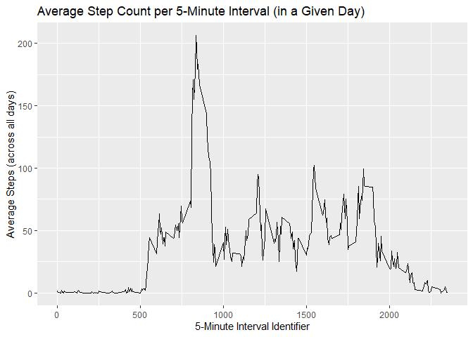
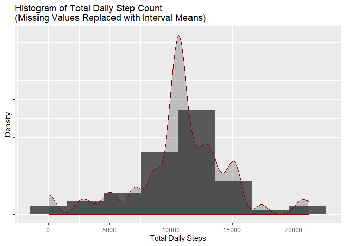
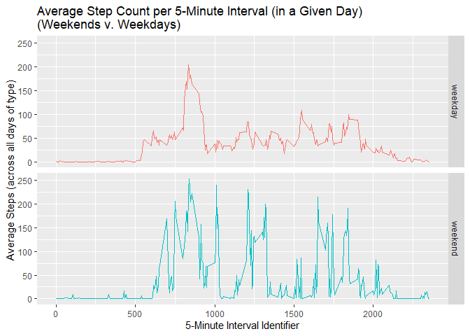

## Loading and preprocessing the data
### <b>1. Processing code</b>
<br>  

Here we read in the dataset and perform some processing. In particular, we download the zip file, unzip the file, then load the .csv file into a data frame. 

```r
### Download the data.
urlZip <- paste0("https://d396qusza40orc.cloudfront.net/",
                "repdata%2Fdata%2Factivity.zip")
download.file(urlZip, destfile = "activity_data.zip")
unzip("activity_data.zip", exdir = "data")


activity <- read.csv("data/activity.csv", na.strings = "NA")
head(activity)
```

```
##   steps       date interval
## 1    NA 2012-10-01        0
## 2    NA 2012-10-01        5
## 3    NA 2012-10-01       10
## 4    NA 2012-10-01       15
## 5    NA 2012-10-01       20
## 6    NA 2012-10-01       25
```
<br>  
  
Load relevant libraries.  


```r
library(dplyr, warn.conflicts = F)
```

```
## Warning: package 'dplyr' was built under R version 3.6.3
```

```r
library(lubridate, warn.conflicts = F)
```

```
## Warning: package 'lubridate' was built under R version 3.6.3
```

```r
library(ggplot2, warn.conflicts = F)
```

```
## Warning: package 'ggplot2' was built under R version 3.6.3
```
<br>  
  
The only processing we do is changing the date column's class into a Date object.  


```r
activity <- activity %>% mutate(date = ymd(date))

head(activity)
```

```
##   steps       date interval
## 1    NA 2012-10-01        0
## 2    NA 2012-10-01        5
## 3    NA 2012-10-01       10
## 4    NA 2012-10-01       15
## 5    NA 2012-10-01       20
## 6    NA 2012-10-01       25
```
<br>    


## What is mean total number of steps taken per day?

<br>    
  
### <b>2. Histogram of the total number of steps taken each day</b>
<br>  
  
Initially, we disregard the missing values in the data frame. To calculate the total number of steps taken each day, we group the data frame by date, then apply the `sum()` function to each group. The resulting data frame is stored in a new data frame called `activDaily`.  


```r
activDaily <- (activity %>%
                 select(steps, date) %>%
                 group_by(date) %>%
                 mutate(steps = sum(steps, na.rm = TRUE)) %>%
                 unique)

activDaily
```

```
## # A tibble: 61 x 2
## # Groups:   date [61]
##    steps date      
##    <int> <date>    
##  1     0 2012-10-01
##  2   126 2012-10-02
##  3 11352 2012-10-03
##  4 12116 2012-10-04
##  5 13294 2012-10-05
##  6 15420 2012-10-06
##  7 11015 2012-10-07
##  8     0 2012-10-08
##  9 12811 2012-10-09
## 10  9900 2012-10-10
## # ... with 51 more rows
```
<br>    
  
Using `ggplot2`, we construct the histogram. Note that the number of bins of the histogram is assigned by using the formula  
<center>$\text{# bins} = \lceil\sqrt{n} \ \rceil\tag{1}$</center>  
where $n$ is the number of rows in `activDaily`.  

We also include a nonparametric kernel density estimate.

<b>Note:</b> Y-axis tick-labeling has been turned off since we are only interested in the shape of the distribution.
  

```r
g <- ggplot(activDaily, aes(x = steps))
(g + geom_histogram(aes(y = ..density..),
                    bins = ceiling(sqrt(nrow(activDaily))))
  + stat_density(bw = "SJ", col = "darkred", alpha = 1/4)
  + labs(x = "Total Daily Steps", y = "Density",
         title = "Histogram of Total Daily Step Count")
  + theme(axis.text.y = element_blank()))
```

<!-- -->
<br>  
  
### <b>3. Mean and median number of steps taken each day</b>

This computation is straightforward.


```r
mean(activDaily$steps)
```

```
## [1] 9354.23
```

```r
median(activDaily$steps)
```

```
## [1] 10395
```


## What is the average daily activity pattern?


### <b>4. Time series plot of the average number of steps taken</b>

For this plot, we refer to the average number of steps taken in a given 5-minute interval, _averaged across all days._

We group the original data frame `activity` by interval identifier, then apply `mean()` to each group (taking missing values into account) to form a new data frame called `activInterval`.


```r
activInterval <- (activity %>%
                    select(interval, steps) %>%
                    group_by(interval) %>%
                    mutate(steps = mean(steps, na.rm = TRUE)) %>%
                    unique)
activInterval
```

```
## # A tibble: 288 x 2
## # Groups:   interval [288]
##    interval  steps
##       <int>  <dbl>
##  1        0 1.72  
##  2        5 0.340 
##  3       10 0.132 
##  4       15 0.151 
##  5       20 0.0755
##  6       25 2.09  
##  7       30 0.528 
##  8       35 0.868 
##  9       40 0     
## 10       45 1.47  
## # ... with 278 more rows
```

The number of rows in `activInterval` makes sense since each day is partitioned into 5-minute intervals, hence  

<center>$\frac{24 \text{hr}}{1 \text{day}} \cdot \frac{60 \text{min}}{1} \cdot \frac{1}{5 \text{min}} = 288 \tag{2}$ </center>  

Now, we construct the time series plot. Note that the interval values (on the x-axis) are meaningless and merely serve as identifiers that give the intervals temporal order (i.e. treat their values as indices).  


```r
h <- ggplot(activInterval, aes(x = interval, y = steps))
(h + geom_line()
  + labs(x = "5-Minute Interval Identifier",
         y = "Average Steps (across all days)", 
         title = paste0("Average Step Count per", 
                " 5-Minute Interval (in a Given Day)")))
```

<!-- -->

Of course, many people are asleep during the tail ends of the day. This could explain both the  missing values and at-or-near-zero measurements for average number of steps during early-morning and late-night five-minute intervals. 

###<b> 5. The 5-minute interval that, on average, contains the maximum number of steps</b>

To identify this particular interval, we first obtain its index using the `which()` function and store it in a variable called `idx`. Then we subset `activInterval` using the index.


```r
iMax <- with(activInterval, which(steps ==max(steps)))
activInterval[iMax,]
```

```
## # A tibble: 1 x 2
## # Groups:   interval [1]
##   interval steps
##      <int> <dbl>
## 1      835  206.
```

This interval identifier corresponds precisely to the time series plot above.


## Imputing missing values


### <b> 6. Code to describe and show a strategy for imputing missing data. </b>

Coerce a logical vector to obtain the number of missing values in the data set (`activity`). We can also find out what proportion of the data set consists of missing values for the `steps` variable.


```r
sum(is.na(activity$steps))
```

```
## [1] 2304
```

```r
sum(is.na(activity$steps))/nrow(activity)
```

```
## [1] 0.1311475
```

A quick, unsophisticated approach is to replace each missing value with their _corresponding time interval's mean step count._ These replacement values correspond directly to the data frame `activInterval` above.

We perform a left join of `activity` (left = x) and `activInterval` (right = y) on the column `interval`, then replace missing values in `steps.x` with its adjacent values in `steps.y`. The merged data frame will be called `activity2`.


```r
activity2 <- left_join(x = activity,
                       y = activInterval,
                       by = "interval")
head(activity2)
```

```
##   steps.x       date interval   steps.y
## 1      NA 2012-10-01        0 1.7169811
## 2      NA 2012-10-01        5 0.3396226
## 3      NA 2012-10-01       10 0.1320755
## 4      NA 2012-10-01       15 0.1509434
## 5      NA 2012-10-01       20 0.0754717
## 6      NA 2012-10-01       25 2.0943396
```

```r
# temporary vector storing the indices of missing values:
idxNA <- with(activity2, which(is.na(steps.x)))

activity2$steps.x[idxNA] <- activity2$steps.y[idxNA]
head(activity2)
```

```
##     steps.x       date interval   steps.y
## 1 1.7169811 2012-10-01        0 1.7169811
## 2 0.3396226 2012-10-01        5 0.3396226
## 3 0.1320755 2012-10-01       10 0.1320755
## 4 0.1509434 2012-10-01       15 0.1509434
## 5 0.0754717 2012-10-01       20 0.0754717
## 6 2.0943396 2012-10-01       25 2.0943396
```

Now we select only the relevant columns and rename.


```r
activity2 <- (activity2 %>%
                select(steps.x, date, interval) %>%
                rename(steps = steps.x))
head(activity2)
```

```
##       steps       date interval
## 1 1.7169811 2012-10-01        0
## 2 0.3396226 2012-10-01        5
## 3 0.1320755 2012-10-01       10
## 4 0.1509434 2012-10-01       15
## 5 0.0754717 2012-10-01       20
## 6 2.0943396 2012-10-01       25
```

### <b>7. Histogram of the total number of steps taken each day after missing values are imputed </b>

(The code for this is analogous to #2.)

To calculate the total number of steps taken each day, we group the data frame by date, then apply the `sum()` function to each group. The resulting data frame is stored in a new data frame called `activDaily2`.  


```r
activDaily2 <- (activity2 %>%
                     select(steps, date) %>%
                     group_by(date) %>%
                     mutate(steps = sum(steps)) %>%
                     unique)
head(activDaily2)
```

```
## # A tibble: 6 x 2
## # Groups:   date [6]
##    steps date      
##    <dbl> <date>    
## 1 10766. 2012-10-01
## 2   126  2012-10-02
## 3 11352  2012-10-03
## 4 12116  2012-10-04
## 5 13294  2012-10-05
## 6 15420  2012-10-06
```

We use math formula (1) for the bin size of the histogram and disregard y-axis tick-labeling since we are only interested in the shape of the distribution.


```r
g2 <- ggplot(activDaily2, aes(x = steps))
(g2 + geom_histogram(aes(y = ..density..), 
                     bins = ceiling(sqrt(nrow(activDaily2))))
  + stat_density(bw = "SJ", col = "darkred", alpha = 1/4)
  + labs(x = "Total Daily Steps", y = "Density", 
         title = paste0("Histogram of Total Daily Step Count",
                        "\n(Missing Values Replaced with Interval Means)"))
  + theme(axis.text.y = element_blank()))
```

<!-- -->

The distribution after replacing the missing values with the corresponding intervals' mean step counts is _much_ more symmetric. The new mean and median of the total number of steps per day confirm the symmetry of the distribution:


```r
mean(activDaily2$steps)
```

```
## [1] 10766.19
```

```r
median(activDaily2$steps)
```

```
## [1] 10766.19
```


## Are there differences in activity patterns between weekdays and weekends?

### <b>8. Panel plot comparing the average number of steps taken per 5-minute interval across weekdays and weekends</b>

<b>Note:</b> This plot uses the data frame `activity2` (missing values mean-replaced).

Create a binary variable aligned with the date column in the data set (=1 if weekend, = 0 weekday). We again use the `lubridate` library and note that `6, 7` correspond to Saturday and Sunday.

We also relabel the boolean values to be corresponding character strings.


```r
activity2$group <- day(activity2$date) %in% c(6,7)

#Relabel TRUE as "weekend" and FALSE as "weekday":
activity2$group[with(activity2,grep(TRUE,group))] <- "weekend"
activity2$group[with(activity2,grep(FALSE,group))] <- "weekday"

table(activity2$group)
```

```
## 
## weekday weekend 
##   16416    1152
```

We use `dplyr` to find the average number of steps per interval across all weekends and weekdays by performing the following:  

1.  make the binary variable a factor variable,
2. group by the binary variable and interval identifier, 
3. apply the mean function to the steps columns.  
 
`dplyr` will automatically re-insert the factor variable. The result is stored in the data frame `activInterval2`.


```r
activInterval2 <- (activity2 %>%
                     mutate(group = as.factor(group)) %>%
                     group_by(group, interval) %>%
                     select(steps) %>%
                     mutate(steps = mean(steps)) %>%
                     ungroup(interval, group) %>%
                     unique)
```

```
## Adding missing grouping variables: `group`, `interval`
```

```r
head(activInterval2)
```

```
## # A tibble: 6 x 3
##   group   interval  steps
##   <fct>      <int>  <dbl>
## 1 weekday        0 1.84  
## 2 weekday        5 0.363 
## 3 weekday       10 0.141 
## 4 weekday       15 0.162 
## 5 weekday       20 0.0808
## 6 weekday       25 2.24
```


Here is the code for the panel plot using `ggplot2`. 


```r
h2 <- ggplot(activInterval2, aes(x = interval, y = steps,
                                 color = group))
(h2 + geom_line() 
    + facet_grid(group ~ .)
    + labs(x = "5-Minute Interval Identifier",
           y = "Average Steps (across all days of type)", 
            title = paste0("Average Step Count", 
                           " per 5-Minute Interval",
                           " (in a Given Day)",
                           "\n(Weekends v. Weekdays)"))
    + theme(legend.position = "none"))
```

<!-- -->

Thank you.
